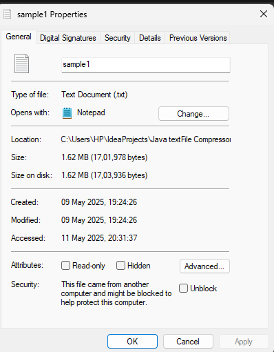
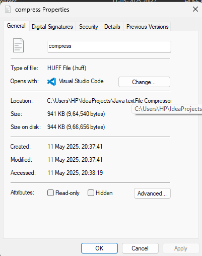
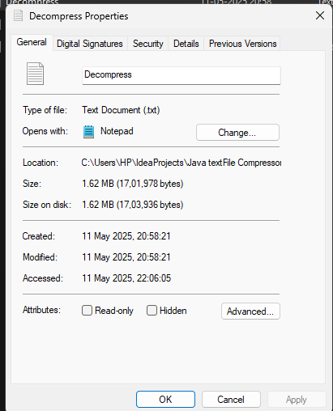
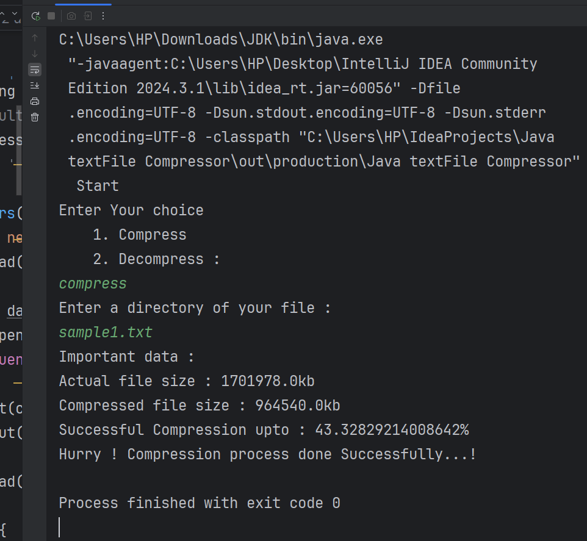
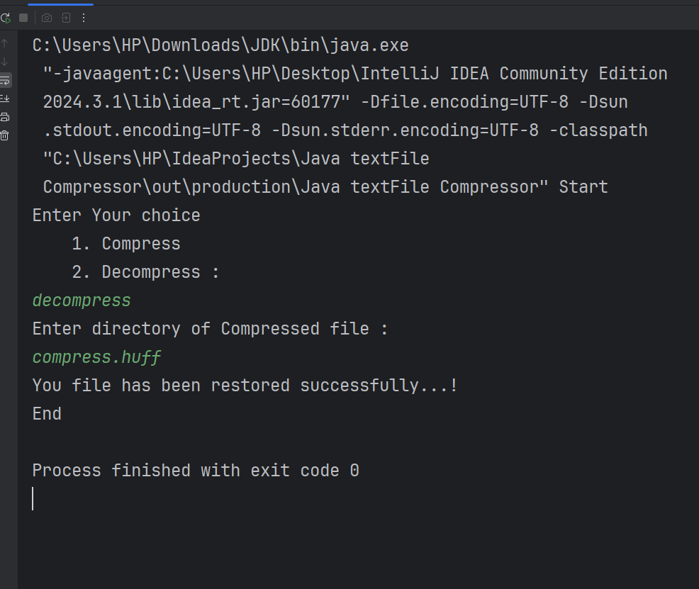

<h1><b># 📦 File Compression & Decompression Tool (Java + Huffman Encoding)</b></h1>

A Java-based file compression tool that uses **Huffman Encoding** to compress and decompress files efficiently. This project demonstrates <b>lossless compression</b> using core Java and DSA concepts — perfect for learning how real-world compression algorithms work!

---

<h1>## 🔍 Example Use Case (Real File Data)</h1>
<table>
  <tr>
    <th>SrNo</th>
    <th>File</th>
    <th>Type(.txt)</th>
    <th>Size</th>
  </tr>
  <tr>
    <td>1</td>
    <td>sample1.txt</td>
    <td>Original</td>
    <td>1.62MB</td>
  </tr>
  <tr>
    <td>2</td>
    <td>compressed.huff</td>
    <td>Compressed</td>
    <td>941 KB</td>
  </tr>
  <tr>
    <td>3</td>
    <td>decompressed.txt</td>
    <td>Decompressed</td>
    <td>1.62 MB</td>
  </tr>
</table>

---
<h2>📁 File Properties</h2>

<p><strong>Original File</strong></p>


<p><strong>Compressed File</strong></p>


<p><strong>Decompressed File</strong></p>


---

🧠 **Compression Efficiency:**
- Original size: **1.62 MB**
- Compressed size: **941 KB**
- ⏬ **Compressed ~42%** (i.e., **58% size reduction**)

✅ The decompressed file matches the original exactly — proving **lossless compression**.

---

## 🧠 Algorithm Used – Huffman Encoding

Huffman Encoding is a **Greedy Algorithm** used for lossless compression:
1. Count frequency of characters
2. Build a priority queue (min-heap)
3. Construct Huffman Tree
4. Assign binary codes to each character
5. Replace text with binary codes to reduce size

> More frequent characters get shorter binary codes.

---

<h2>🧰 Data Structures Used</h2>

<table>
  <thead>
    <tr>
      <th>Data Structure</th>
      <th>Purpose</th>
    </tr>
  </thead>
  <tbody>
    <tr>
      <td>HashMap</td>
      <td>Store character frequencies</td>
    </tr>
    <tr>
      <td>PriorityQueue (MinHeap)</td>
      <td>Build Huffman Tree from character frequencies</td>
    </tr>
    <tr>
      <td>Binary Tree</td>
      <td>Represent Huffman Tree nodes</td>
    </tr>
    <tr>
      <td>HashMap&lt;Character, String&gt;</td>
      <td>Store generated binary codes</td>
    </tr>
    <tr>
      <td>FileInputStream / FileOutputStream</td>
      <td>Handle file I/O</td>
    </tr>
  </tbody>
</table>
---
<table>
  <thead>
    <tr>
      <th>File Type</th>
      <th>Supported</th>
      <th>Notes</th>
    </tr>
  </thead>
  <tbody>
    <tr>
      <td>.txt</td>
      <td>✅</td>
      <td>Recommended for best results</td>
    </tr>
    <tr>
      <td>.csv</td>
      <td>✅</td>
      <td>Works like .txt (text format)</td>
    </tr>
    <tr>
      <td>.java</td>
      <td>✅</td>
      <td>Any text-based file</td>
    </tr>
    <tr>
      <td>.html</td>
      <td>✅</td>
      <td>HTML files supported</td>
    </tr>
    <tr>
      <td>.png/.jpg</td>
      <td>⚠️ Partial</td>
      <td>Compresses, but not efficient (binary)</td>
    </tr>
    <tr>
      <td>.pdf</td>
      <td>⚠️ Partial</td>
      <td>Compresses, but not recommended</td>
    </tr>
  </tbody>
</table>

---

<h2>📂 Command Line Interaction</h2>
<h2>💻 CLI Interaction</h2>

<p>
  
</p>

<p>
  
</p>


---

---
<h1>Made with 💻 by Bhushan Khandait</h1>
<p>Connect on:
  <a href="https://github.com/khandaitBhushan" target="_blank">GitHub</a> |
  <a href="https://www.linkedin.com/in/iambhushan07" target="_blank">LinkedIn</a> |
  <a href="https://leetcode.com/u/i_am_bhushan/" target="_blank">Leetcode</a>
</p>

---


## 📂 Project Structure

```bash
FileCompressionProject/
├── src/
│   ├── FileCompressor.java
│   ├── FileDecompressor.java
├── sample-files/
│   ├── sample1.txt
│   ├── compressed.huff
│   ├── decompressed.txt
├── README.md
└── .gitignore

